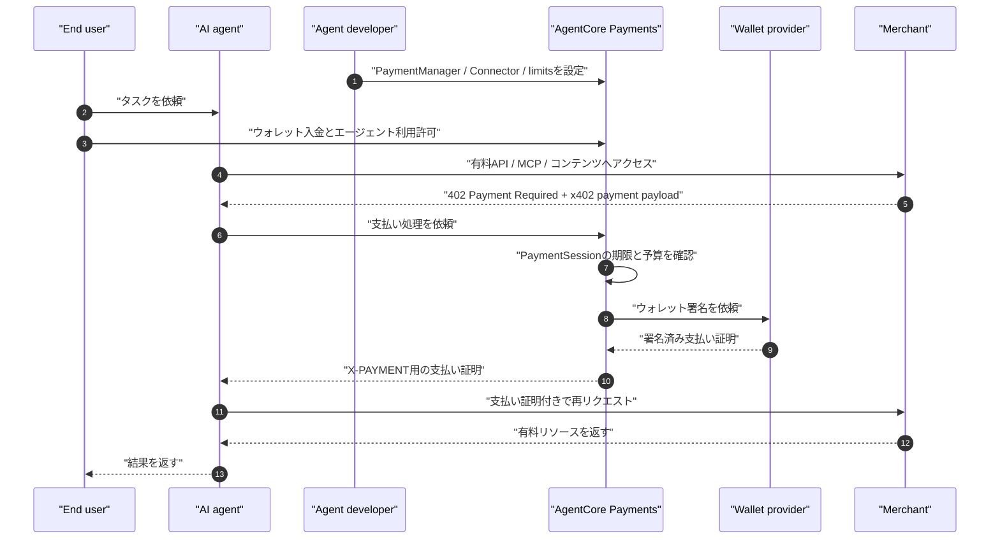
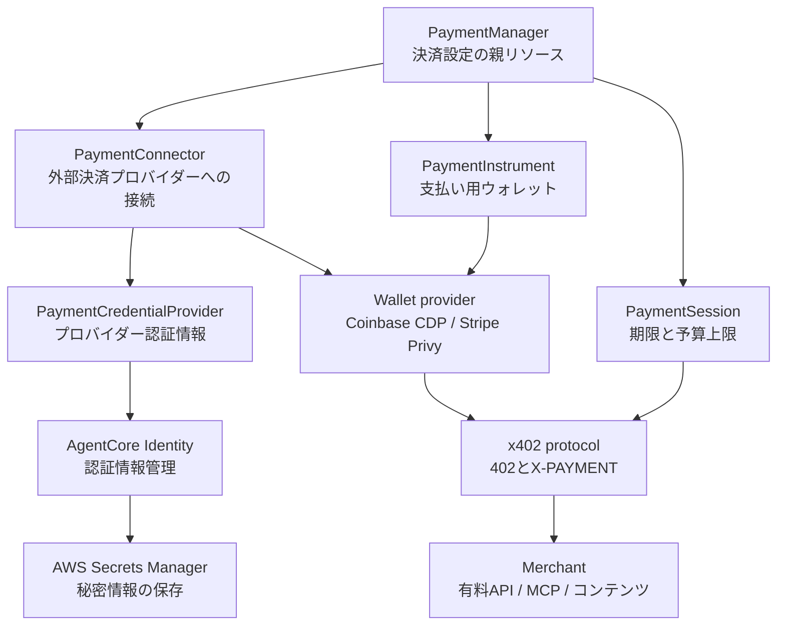

# AWS AgentCore Paymentsを加味した整理

## 1. これは何か

Amazon Bedrock AgentCore Paymentsは、AIエージェントが有料API、有料MCPサーバー、有料コンテンツなどにアクセスするときの支払いを扱うためのAWSマネージドサービスです。

公式ドキュメント:

- https://docs.aws.amazon.com/bedrock-agentcore/latest/devguide/payments.html
- https://docs.aws.amazon.com/bedrock-agentcore/latest/devguide/payments-concepts.html

一般論としては「AIエージェント向けのProgrammatic payments」を、AWSのAgentCoreの中で扱えるようにしたものです。

## 2. AgentCore Paymentsを使うと何ができるのか

AgentCore Paymentsを使うと、AIエージェントが有料リソースにアクセスするときの支払いフローをAWS側で扱いやすくできます。

具体的には、次のことができます。

- 有料API、有料MCPサーバー、有料コンテンツに対するx402支払いを処理する
- 支払いに使うウォレットを `PaymentInstrument` として管理する
- 1回のタスクごとの支払い枠を `PaymentSession` として作る
- セッションごとに予算上限と有効期限を設定する
- Coinbase CDPまたはStripe/Privyなどの外部ウォレット基盤に接続する
- 支払い要求を受け取り、ウォレット署名を行い、支払い証明を返す
- CloudWatchやX-Rayで支払い処理を監視する

つまり、単なる「支払い設定の管理画面」ではありません。

AgentCore Paymentsは、エージェントがx402の `402 Payment Required` を受け取った後に、予算確認、ウォレット連携、署名、支払い証明の生成までを支援します。

## 3. 支払い自体は別に必要なのか

はい。支払い自体は別に必要です。

AgentCore Paymentsは、AWSが独自にお金を立て替えたり、AWS請求に自動でまとめたりするサービスではありません。

実際の支払いには、次のような外部の支払いレールが必要です。

```text
支払い残高:
  ユーザーまたは事業者がウォレットに入金する

ウォレット:
  Coinbase CDPまたはStripe/Privyなどで管理される

支払い手段:
  ステーブルコインなど

決済レール:
  ブロックチェーン / オンチェーン決済
```

AgentCore Paymentsの役割は、その支払いレールをAIエージェントの実行フローに組み込むことです。

```text
AgentCore Paymentsがやること:
  支払い要求を受け取る
  予算上限を確認する
  外部ウォレットに署名させる
  支払い証明を作る
  ログやトレースを残す

AgentCore Paymentsだけでは完結しないこと:
  ウォレットへの入金
  ステーブルコインの発行
  外部プロバイダーの認証情報取得
  Merchant側のx402対応
  法務、会計、税務、暗号資産ポリシーの判断
```

AWS利用者向けに短く言うと、AgentCore Paymentsは「AWS請求で外部API代を払ってくれる機能」ではなく、「エージェントが外部の有料リソースにx402で払うための支払い実行・制御レイヤー」です。

### 3.1 支払い自体を成立させるには何が必要か

支払い自体を成立させるには、AgentCore Paymentsとは別に、次の準備が必要です。

```text
1. Coinbase CDPまたはStripe/Privyを用意する
2. AgentCore Paymentsから接続するPaymentConnectorを作る
3. ユーザーまたは事業者のPaymentInstrumentを作る
4. そのウォレットに残高を入れる
5. エージェントがそのウォレットを使う権限をユーザーが許可する
6. PaymentSessionで予算と期限を設定する
7. x402対応のMerchantに対して支払い証明を出す
```

つまり、支払い元になる残高は、AWSの請求アカウントではなく、Coinbase CDPまたはStripe/Privy側のウォレットにあります。

公式ドキュメントでは、`PaymentInstrument` を作った直後のウォレットは残高なしの状態として説明されています。そのため、ユーザーがウォレット画面で入金し、エージェントへの利用許可を与える手順が必要になります。

```text
Coinbase CDPの場合:
  Coinbase WalletHubにユーザーをリダイレクトする
  ユーザーがウォレットに入金する
  ユーザーがエージェントに利用許可を与える

Stripe/Privyの場合:
  Privy-powered frontendを用意する
  ユーザーがログインする
  ユーザーがウォレットに入金する
  ユーザーがエージェントに利用許可を与える
```

## 4. Web3との関係

AgentCore Paymentsは、Web3という言葉を前面に出したサービスではありません。

ただし、公式ドキュメントで説明されている構成には、Web3寄りの要素が含まれます。

- ステーブルコイン
- 暗号資産ウォレット
- Coinbase CDP
- Stripe/Privy
- x402
- オンチェーン決済

つまり、AWSサービスとしては「AIエージェントの決済機能」ですが、実際の支払いレールとしてはステーブルコインやウォレットなどのWeb3系技術を利用します。

```text
AWS側の見え方:
  AgentCore Paymentsというマネージドサービス

決済レール側の見え方:
  x402、ウォレット、ステーブルコイン、オンチェーン決済
```

そのため、AWS利用者としてはIAM、Identity、CloudWatchのようなAWS運用の観点と、ウォレット、秘密鍵、ステーブルコイン、規制対応のようなWeb3/決済の観点を両方見る必要があります。

## 5. AWSを入れると何が変わるか

AWSを入れない一般論では、開発者が自分で次のような部品を作る必要があります。

- 支払いセッション
- 支払い上限
- ウォレット認証情報管理
- x402リクエスト処理
- 支払い証明の作成
- ログ
- 監査
- 外部ツールとの接続

AgentCore Paymentsでは、これらをAWSのリソースやAPIとして扱います。

## 6. 登場人物

登場人物の関係をシーケンスで見ると、次のようになります。



### 6.1 Agent developer

AIエージェントを作る開発者です。

AgentCore Paymentsの設定、ウォレット連携、支払い上限、IAMロール、監視などを管理します。

### 6.2 End user

AIエージェントを使う利用者です。

エージェントに作業を依頼し、その作業の中で発生する支払いを許可します。

### 6.3 Merchant

有料API、有料MCPサーバー、有料コンテンツを提供する側です。

x402などを使って支払いを要求し、支払い確認後にリソースを返します。

## 7. 主要リソース

主要リソースの関係を図にすると、次のようになります。



### 7.1 PaymentManager

AgentCore Paymentsの親リソースです。

「このアプリやチームのエージェント決済を管理する単位」と考えると分かりやすいです。

本番、ステージング、開発、チーム別、アプリ別などで分けることが想定されます。

### 7.2 PaymentConnector

PaymentManagerと外部決済プロバイダーをつなぐ設定です。

公式ドキュメントでは、Coinbase CDPやStripe/Privyとの連携が説明されています。

ここでいう外部決済プロバイダーは、実際のウォレット操作やステーブルコイン決済に必要な機能を提供する側です。AgentCore Payments自体が独自のステーブルコインやウォレットを発行するというより、外部プロバイダーとつないで支払いを実行します。

公式ドキュメント上の connector type は次の2つです。

```text
CoinbaseCDP:
  Coinbase Developer Platformに接続する
  暗号資産ウォレット操作やステーブルコイン決済のために使う

StripePrivy:
  StripeとPrivyのウォレット基盤に接続する
  Privyの埋め込みウォレットや認証情報を使う
```

01ではCoinbaseを「x402の開発元」として説明しました。ここでのCoinbase CDPは、AWS AgentCore Paymentsが実際のウォレット操作や支払い署名のために接続する外部プロバイダーです。

AWS側の役割は、これらのプロバイダーをAgentCore Paymentsから安全に呼び出せるようにすることです。

```text
PaymentManager
  ↓
PaymentConnector
  ↓
Coinbase CDP または Stripe/Privy
  ↓
ウォレット署名・支払い証明
```

APIキー、ウォレット秘密情報、Privyの認証情報などは、Payments APIに直接渡すのではなく、AgentCore Identity経由でAWS Secrets Managerに保存されます。

### 7.3 PaymentSession

1つのエージェント作業に対する支払い枠です。

例:

```text
このユーザーのこの調査タスクでは最大5ドルまで
有効期限は30分
```

この上限や期限を超えると、それ以上の支払いは拒否されます。

### 7.4 PaymentInstrument

実際の支払いに使うウォレットです。

公式ドキュメントでは、組み込み型の暗号資産ウォレットが説明されています。

### 7.5 PaymentCredentialProvider

決済プロバイダーの認証情報を安全に扱うための仕組みです。

Coinbase CDPのAPIキーやPrivyの認証情報などを、AgentCore Identity経由で管理します。

PaymentConnectorとPaymentCredentialProviderは1対1で対応します。たとえば、Coinbase用のPaymentConnectorにはCoinbase用の認証情報、Stripe/Privy用のPaymentConnectorにはPrivy app credentialsやauthorization keysが紐づきます。

### 7.6 x402 protocol

HTTPの `402 Payment Required` を使って、支払い要求と支払い証明をやり取りするプロトコルです。

AgentCore Paymentsは、エージェントがx402対応の有料リソースにアクセスするときの支払い処理を支援します。

## 8. 全体の流れ

```text
1. End userがAIエージェントに依頼する
2. Agent developerのアプリがPaymentSessionを作る
3. 支払い上限、有効期限、利用するPaymentConnectorを設定する
4. エージェントが有料APIや有料MCPサーバーにアクセスする
5. Merchantが 402 Payment Required を返す
6. AgentCore Paymentsが支払い要求を処理する
7. PaymentInstrumentを使って支払い証明を作る
8. エージェントが支払い証明付きで再リクエストする
9. Merchantが検証し、API結果やコンテンツを返す
10. CloudWatchやX-Rayで監視、ログ確認を行う
```

## 9. AgentCore内での位置づけ

AgentCore Paymentsだけで完結するというより、AgentCoreの他の機能と組み合わせて使います。

```text
AgentCore Runtime
  エージェントを動かす

AgentCore Gateway
  外部ツール、API、MCPサーバーにつなぐ

AgentCore Identity
  認証情報やウォレット関連の秘密情報を管理する

AgentCore Payments
  有料リソースへの支払いを管理する

CloudWatch / X-Ray
  監視、ログ、トレースを行う
```

## 10. 何に使えるか

典型的なユースケースは次の通りです。

- 調査エージェントが有料データソースを必要なときだけ使う
- 金融分析エージェントがリアルタイム市場データを購入する
- ブラウザ操作エージェントが有料コンテンツにアクセスする
- エージェントが外部AIモデルや推論サービスを使い分ける
- MCPサーバー上の有料ツールを呼び出す

## 11. AWS利用者としての理解

AWSを触っている人向けに言うと、AgentCore Paymentsは次のような位置づけです。

```text
IAM
  誰がAgentCore Paymentsを設定、実行できるかを制御する

AgentCore Identity
  外部決済プロバイダーの認証情報を安全に扱う

PaymentManager
  決済設定の親リソース

PaymentConnector
  Coinbase CDPやStripe/Privyなどへの接続設定

PaymentSession
  タスクごとの支払い予算と期限

CloudWatch / X-Ray
  支払いの監視とトラブルシュート
```

## 12. 注意点

AgentCore Paymentsは、公式ドキュメント上ではプレビュー機能として説明されています。一般提供前にAPIや仕様が変わる可能性があります。

また、ステーブルコインや暗号資産ウォレットを扱うため、技術面だけでなく以下の確認が必要です。

- 会社として暗号資産やステーブルコインを使えるか
- 会計処理をどうするか
- 法務、税務、コンプライアンス上問題ないか
- 誰が残高を管理するか
- 誤支払い、過剰支出、悪意ある支払い要求をどう防ぐか
- 本番で使えるリージョン、料金、SLA、サポート状況はどうか

## 13. まとめ

一般論では、x402とステーブルコインはHTTP/API向けの少額決済の仕組みです。

AIエージェントを加味すると、それは「エージェントが外部の有料リソースを必要なときに使うための決済レイヤー」になります。

AWS AgentCore Paymentsを加味すると、その決済レイヤーをAWSのリソース、IAM、Identity、Gateway、CloudWatch/X-Rayと組み合わせて運用できるようになります。
