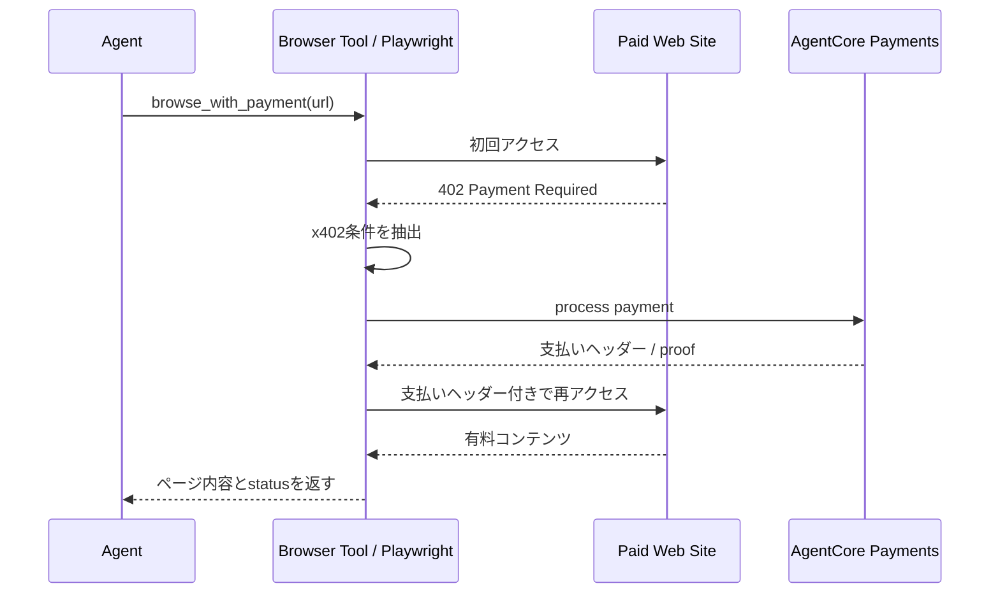
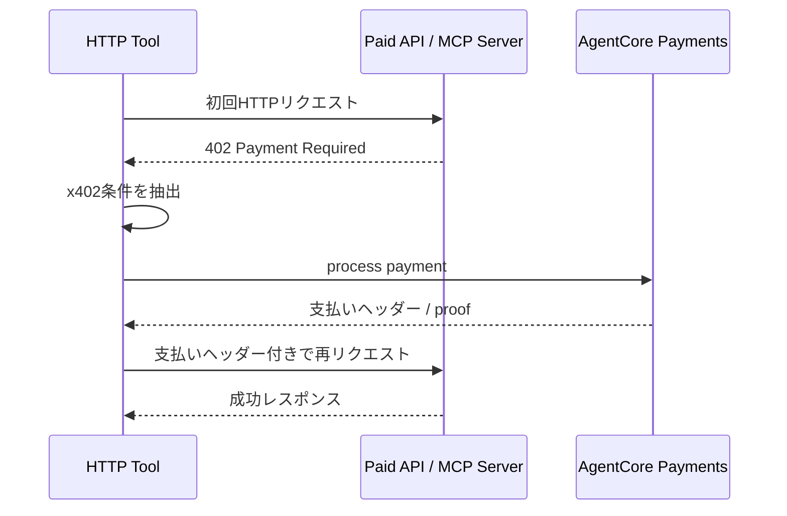

# AWS AgentCore Paymentsの実装の流れ

## 1. このファイルの位置づけ

このファイルは、AWS AgentCore Paymentsを実装するときに「何をどの順番で作るのか」を整理したものです。

前の3つのファイルとの関係は次の通りです。

```text
01:
  Programmatic paymentsの一般論

02:
  AIエージェントでなぜ必要になるか

03:
  AWS AgentCore Paymentsでは何が登場するか

04:
  実際にAWS上でどう組み立てるか
```

公式ドキュメント:

- https://docs.aws.amazon.com/bedrock-agentcore/latest/devguide/payments-getting-started.html
- https://docs.aws.amazon.com/bedrock-agentcore/latest/devguide/payments-how-it-works.html
- https://docs.aws.amazon.com/bedrock-agentcore/latest/devguide/payments-prerequisites.html
- https://docs.aws.amazon.com/bedrock-agentcore/latest/devguide/payments-create-manager.html
- https://docs.aws.amazon.com/bedrock-agentcore/latest/devguide/payments-processing.html
- https://docs.aws.amazon.com/bedrock-agentcore/latest/devguide/payments-browser.html

## 2. 全体像

実装の流れは、大きく分けると次の順番です。

```text
1. 前提準備
2. 決済プロバイダーの認証情報を保存する
3. IAMロールを用意する
4. PaymentManagerを作る
5. PaymentConnectorを作る
6. PaymentInstrumentを作る
7. ウォレットに入金し、エージェントに利用許可を与える
8. PaymentSessionを作る
9. 有料エンドポイントにアクセスし、x402支払いを処理する
10. CloudWatch / X-Rayで監視する
```

AWSのリソースとして見ると、中心になるのは次です。

```text
PaymentCredentialProvider
  決済プロバイダーの認証情報

PaymentManager
  AgentCore Paymentsの親リソース

PaymentConnector
  Coinbase CDPまたはStripe/Privyへの接続

PaymentInstrument
  支払いに使う埋め込み暗号資産ウォレット

PaymentSession
  期限と予算上限を持つ支払い枠
```

## 3. 前提準備

公式のGetting startedでは、前提として次が必要です。

- AWSアカウントとAWS認証情報
- Python 3.10以上
- Boto3
- AgentCore SDK
- Coinbase CDPまたはStripe Privyの認証情報
- AgentCore Paymentsが利用可能なAWSリージョン

2026年5月時点の公式ドキュメントでは、対応リージョンとして次が挙げられています。

```text
us-east-1
us-west-2
eu-central-1
ap-southeast-2
```

Pythonパッケージは、このプロジェクトでは `uv` で管理します。

```bash
uv add boto3
uv add 'bedrock-agentcore[strands-agents]'
```

AWS CLIと認証情報も先に確認します。

```bash
aws --version
aws sts get-caller-identity
```

`CUSTOM_JWT` でPaymentManagerにアクセスさせたい場合は、CognitoやOktaなどのIDプロバイダーも先に用意します。開発検証では `AWS_IAM` の方が分かりやすいです。

## 4. 決済プロバイダーを選ぶ

AgentCore Paymentsでは、ウォレット連携先として次のどちらかを使います。

```text
CoinbaseCDP:
  Coinbase Developer Platformに接続する
  暗号資産ウォレット操作やステーブルコイン決済に使う

StripePrivy:
  Stripe + Privyのウォレット基盤に接続する
  Privyの埋め込みウォレットや認証情報を使う
```

ここで選んだプロバイダーのAPIキー、ウォレット秘密情報、Privy app credentials、authorization keysなどを、後続の `PaymentCredentialProvider` に保存します。

必要な認証情報はプロバイダーごとに違います。

```text
Coinbase CDP:
  API Key ID
  API Key Secret
  Wallet Secret
  Delegated signingの有効化

Stripe/Privy:
  Privy App ID
  Privy App Secret
  Authorization ID
  Authorization Private Key
```

PrivyのAuthorization Private Keyは、ダッシュボード上で `wallet-auth:` という接頭辞付きで表示される場合があります。AgentCore Paymentsに保存するときは、この接頭辞を外してbase64本体だけを使います。

PrivyのApp SecretやAuthorization Private Keyは、AgentCore Paymentsのサービスロール以外から読めないようにします。ここが緩いと、AgentCoreの予算制御や監査を迂回してウォレット操作される危険があります。

## 5. PaymentCredentialProviderを作る

最初に、決済プロバイダーの認証情報をAgentCore Identityに保存します。

これは、アプリコードやPayments APIに秘密情報を直接渡さないためです。AgentCore IdentityがAWS Secrets Managerを使って安全に保持し、AgentCore Paymentsは実行時に必要なトークンを取得します。

```text
Coinbase CDP / Stripe Privyの認証情報
  ↓
AgentCore Identity
  ↓
AWS Secrets Manager
  ↓
PaymentCredentialProvider
```

ここで作った `PaymentCredentialProvider` は、後で `PaymentConnector` から参照されます。

## 6. IAMロールを用意する

AgentCore Paymentsでは、役割を分けることが重要です。

公式ドキュメントでは、主に4種類のロールが説明されています。

```text
ControlPlaneRole:
  PaymentManager、PaymentConnector、CredentialProviderを管理する管理者用ロール

ManagementRole:
  PaymentInstrumentやPaymentSessionを作る開発者用ロール
  支払い実行はできない

ProcessPaymentRole:
  エージェントの代わりにProcessPaymentを実行するロール

ResourceRetrievalRole:
  AgentCore Paymentsサービスが実行時に認証情報を取得するためのサービスロール
```

重要なのは、`PaymentSession` を作る権限と `ProcessPayment` を実行する権限を同じロールに寄せすぎないことです。

同じ主体が「予算上限の高いセッションを作る」ことと「支払いを実行する」ことを両方できると、支出制御が弱くなります。

## 7. PaymentManagerを作る

`PaymentManager` はAgentCore Paymentsの親リソースです。

ここで決める主な内容は次です。

- 名前
- 説明
- inbound authorization
- IAM service role
- どのPaymentConnectorをぶら下げるか

認可方式は、公式ドキュメントでは `AWS_IAM` または `CUSTOM_JWT` が説明されています。

```text
AWS_IAM:
  IAMベースでAgentCore Paymentsにアクセスする

CUSTOM_JWT:
  Cognito、OktaなどのIDプロバイダーのJWTでアクセス制御する
```

開発初期はIAMで始め、本番やユーザー単位の制御が必要になったらJWT連携を検討する、という整理が分かりやすいです。

作成後、`PaymentManager` は `CREATING` から `READY` に遷移します。`READY` になるまで、後続のconnector作成や実行時利用は待つ必要があります。

AWS CLIで作る場合は、control plane APIを使います。

```bash
aws bedrock-agentcore-control create-payment-manager \
  --name "MyPaymentManager" \
  --authorizer-type AWS_IAM \
  --role-arn "arn:aws:iam::123456789012:role/AgentCorePaymentsResourceRetrievalRole" \
  --region us-east-1
```

## 8. PaymentConnectorを作る

`PaymentConnector` は、`PaymentManager` と外部決済プロバイダーをつなぐ設定です。

```text
PaymentManager
  ↓
PaymentConnector
  ↓
Coinbase CDP または Stripe/Privy
```

このとき、5章で作った `PaymentCredentialProvider` を参照します。

`PaymentConnector` は、実行時に次のような処理で使われます。

- 支払い要求を受け取る
- ウォレットに署名させる
- 支払い証明を生成する
- x402の再リクエストに必要なヘッダーを作る

ConsoleではPaymentManager作成時にconnectorを同時に追加できます。AWS CLIやSDKでは、PaymentManagerを作成して `READY` になった後、`PaymentCredentialProvider` を作り、それを参照する `PaymentConnector` を作ります。

公式ドキュメント上のconnector typeは次です。

```text
CoinbaseCDP
StripePrivy
```

AgentCore SDKには、`PaymentManager`、`PaymentCredentialProvider`、`PaymentConnector` をまとめて作る `create_payment_manager_with_connector` という便利メソッドもあります。

## 9. PaymentInstrumentを作る

`PaymentInstrument` は、実際に支払いに使うウォレットです。

公式ドキュメントでは、組み込み型の暗号資産ウォレット、つまり `EMBEDDED_CRYPTO_WALLET` が説明されています。

注意点は、ブロックチェーンネットワークごとにinstrumentが分かれることです。公式例では `ETHEREUM` と `SOLANA` が示されています。

```text
Ethereum用ウォレット
Solana用ウォレット
```

同じユーザーでも、どのネットワークで支払うかによって別のinstrumentが必要になる場合があります。

`PaymentInstrument` にはステータスがあります。

```text
INITIATED:
  作成直後

ACTIVE:
  入金と権限付与が完了し、支払い可能

FAILED:
  作成または連携に失敗

DELETED:
  削除済み
```

## 10. ウォレットに入金し、エージェントに権限を与える

`PaymentInstrument` を作っただけでは、まだ支払いはできません。

ウォレットには残高が必要です。また、エージェントがそのウォレットを使うには、ユーザーからの許可が必要です。

ここが「支払い自体」を成立させる部分です。

AgentCore Paymentsは、支払い要求を処理して支払い証明を作るレイヤーです。一方で、実際の支払い元になる残高は、外部ウォレット側に用意します。

公式ドキュメントでは、作成直後のPaymentInstrumentは `0 USDC` から始まると説明されています。つまり、作っただけでは残高がありません。

Coinbase CDPの場合、公式ドキュメントでは `CreatePaymentInstrument` のレスポンスに含まれる `redirectUrl` からCoinbase WalletHubへユーザーを誘導する流れが説明されています。

Stripe/Privyの場合は、Privy-powered frontendを用意し、ユーザーがログイン、入金、エージェントへの許可を行う流れになります。

支払い可能にするための実務上の流れは次です。

```text
PaymentInstrument作成
  ↓
ユーザーをウォレット画面へ誘導
  ↓
ユーザーが入金する
  ↓
ユーザーがエージェントに利用許可を与える
  ↓
PaymentInstrumentが支払い可能になる
```

### 10.1 Coinbase CDPの場合

Coinbase CDPを使う場合は、`CreatePaymentInstrument` の結果に含まれる `redirectUrl` を使って、ユーザーをCoinbase WalletHubへ誘導します。

WalletHubでは、ユーザーが次の操作を行います。

```text
1. Coinbase WalletHubにログインする
2. ウォレットに入金する
3. エージェントにウォレット利用権限を与える
4. 必要に応じて権限を取り消す
```

入金方法は、暗号資産の送金だけでなく、利用可能な地域ではクレジットカード、デビットカード、Apple Pay、Google Pay、ACHなどの伝統的な支払い手段も使えると公式ドキュメントで説明されています。

### 10.2 Stripe/Privyの場合

Stripe/Privyを使う場合は、開発者側でPrivy-powered frontendを用意します。

ユーザーはその画面で、ログイン、ウォレット接続または作成、入金、エージェントへの許可を行います。

```text
1. Privy-powered frontendを開く
2. ユーザーがログインする
3. ウォレットを作成または接続する
4. ウォレットに入金する
5. エージェントにウォレット利用権限を与える
```

こちらも、暗号資産の送金に加えて、利用可能な地域ではカード、Apple Pay、Google Pay、ACHなどの入金導線が説明されています。

### 10.3 ここで注意すること

支払い自体は、次の条件がそろわないと成功しません。

```text
PaymentInstrumentがACTIVEである
ウォレットに十分な残高がある
ユーザーがエージェントに利用許可を与えている
PaymentSessionが期限切れではない
PaymentSessionの予算上限を超えていない
Merchantがx402に対応している
支払い対象のasset/networkがウォレット側と合っている
```

## 11. PaymentSessionを作る

`PaymentSession` は、1回のエージェント作業に対する支払い枠です。

ここで、期限と予算上限を設定します。

例:

```text
user_id:
  test-user-123

expiry_time_in_minutes:
  60

maxSpendAmount:
  100.00 USD
```

イメージとしては、次のような制御です。

```text
このユーザーのこのタスクでは
60分間だけ
最大100ドルまで
支払いを許可する
```

セッションが期限切れになったり、予算に達したりすると、そのセッションでは追加支払いできません。

## 12. 有料エンドポイントにアクセスする

ここまでで、支払いに必要なものがそろいます。

```text
PaymentManager
PaymentConnector
PaymentInstrument
PaymentSession
```

エージェントが有料API、有料MCPサーバー、有料コンテンツにアクセスすると、相手側がx402形式で `402 Payment Required` を返します。

```text
1. エージェントが有料エンドポイントにアクセス
2. Merchantが 402 Payment Required を返す
3. AgentCore PaymentsがPaymentSessionの予算を確認
4. PaymentConnector経由でウォレット署名
5. 支払い証明を生成
6. エージェントが X-PAYMENT ヘッダー付きで再リクエスト
7. Merchantが検証
8. コンテンツやAPIレスポンスを返す
```

この処理には、大きく2つの実装パターンがあります。

```text
直接HTTP:
  APIやMCPエンドポイントにHTTPリクエストする
  402を検出して、支払い証明付きで再リクエストする

Browser Tool:
  AgentCore Browser / PlaywrightでWebページにアクセスする
  ネットワークレスポンスの402を検出して、同じブラウザセッションで再アクセスする
```

## 13. ProcessPaymentを呼ぶ

低レベルに実装する場合は、`ProcessPayment` APIを直接呼びます。

`ProcessPayment` に必要な前提は2つです。

```text
PaymentInstrument:
  支払いに使うウォレット

PaymentSession:
  期限と予算上限を持つ支払い枠
```

必要になる主な入力は次です。

```text
payment_manager_arn
payment_session_id
payment_instrument_id
payment_type = CRYPTO_X402
x402 payment payload
```

`ProcessPayment` は、支払い要求を検証し、予算上限を確認し、外部ウォレットプロバイダーで署名し、暗号学的な支払い証明を返します。

成功すると、レスポンスのstatusは `PROOF_GENERATED` になります。

その支払い証明を、元の有料エンドポイントへの再リクエストに付けます。

呼び方は主に3つあります。

```text
AWS CLI / AWS SDK:
  process-payment / process_paymentを直接呼ぶ

AgentCore SDK:
  PaymentManager.generate_payment_header() で支払いヘッダーを生成する

Strands SDK:
  AgentCorePaymentsPluginがHTTP 402を検出して自動処理する
```

Strands pluginでは、`auto_payment=False` にすると自動支払いを止められます。人間の承認や独自ロジックを挟みたい場合に使います。

また、`network_preferences_config` で支払いに使うブロックチェーンネットワークの優先順を指定できます。指定しない場合は、低い取引手数料を優先してSolana mainnetやBaseなどが優先されると説明されています。

公式ドキュメントでは、control plane setupが終わった後のprocessing workflowとして、次の流れが分けられています。

```text
1. Create a payment instrument
2. Create a payment session
3. Coinbase Bazaar via AgentCore Gatewayを使う、または自前の有料エンドポイントを使う
4. Process a payment
```

つまり、PaymentManagerやConnectorの作成は初期設定で、`PaymentInstrument`、`PaymentSession`、`ProcessPayment` は実行時またはユーザー操作に近い領域です。

## 14. Strands SDKで自動化する

Strands Agentsを使う場合は、AgentCore Payments pluginを使うと、x402の処理を自動化できます。

公式例では、次のような設定を渡します。

```python
from strands import Agent
from strands_tools import http_request
from bedrock_agentcore.payments.integrations.config import AgentCorePaymentsPluginConfig
from bedrock_agentcore.payments.integrations.strands.plugin import AgentCorePaymentsPlugin

config = AgentCorePaymentsPluginConfig(
    payment_manager_arn="arn:aws:bedrock-agentcore:us-west-2:123456789012:payment-manager/pm-abc123",
    user_id="test-user-123",
    payment_instrument_id="payment-instrument-xyz789",
    payment_session_id="payment-session-def456",
    region="us-west-2",
)

plugin = AgentCorePaymentsPlugin(config=config)

agent = Agent(
    system_prompt="You are a helpful assistant that can access paid APIs.",
    tools=[http_request],
    plugins=[plugin],
)

agent("Access the premium endpoint at https://example.com/paid-api")
```

この場合、エージェントがHTTP 402を受け取ると、pluginが支払い処理を行い、支払い証明付きで再リクエストします。

## 15. Browser Toolで有料Webコンテンツにアクセスする

AgentCore Paymentsは、直接HTTPだけでなくBrowser Toolとも組み合わせられます。

公式ドキュメントでは、x402の有料コンテンツにアクセスする方法を大きく2つに分けています。

```text
Browser Tool integration:
  Webページをブラウザで開く
  ページ遷移や読み込み中のHTTPレスポンスをPlaywrightで監視する
  402が返ったら支払いヘッダーを付けて同じブラウザセッションで再アクセスする

Non-browser HTTP integration:
  APIやMCP serverなどにHTTPクライアントで直接アクセスする
  402が返ったら支払いヘッダーを付けてHTTPリクエストを再送する
```

Browser Toolを使うと、エージェントはAgentCore Runtime内の管理されたheadless Chromiumセッションを使ってWebページを開きます。接続にはChrome DevTools Protocol、実装上の操作にはPlaywrightを使います。

Playwrightのresponse interceptionにより、ページ遷移中に返ってきたHTTP 402を検出できます。

流れは次の通りです。



これは、APIではなくWebページそのものが有料コンテンツやpaywallを持つ場合に関係します。

重要なのは、Browser Toolが「新しい支払い方式」ではないことです。支払いの中身は引き続きx402とAgentCore Paymentsです。Browser Toolは、Webページを開く過程で402を検出し、支払いヘッダーを注入して再アクセスするための実行環境です。

一方で、ブラウザが不要なAPI呼び出しでは、標準のHTTPクライアントやStrandsのHTTP toolで十分です。この場合の流れはより単純です。



## 16. 実装時の最小チェックリスト

最初の検証では、次のチェックリストで進めると分かりやすいです。

```text
[ ] 対応リージョンを選ぶ
[ ] Coinbase CDPまたはStripe Privyの認証情報を用意する
[ ] Privyを使う場合はAuthorization Private Keyのwallet-auth:接頭辞を外す
[ ] AWS CLIとaws sts get-caller-identityを確認する
[ ] PaymentCredentialProviderを作る
[ ] IAMロールを作る
[ ] PaymentManagerを作る
[ ] PaymentManagerがREADYになるまで待つ
[ ] PaymentConnectorを作る
[ ] PaymentInstrumentを作る
[ ] ユーザーがウォレットに入金する
[ ] ユーザーがエージェントにウォレット利用を許可する
[ ] PaymentSessionを作る
[ ] x402対応の有料エンドポイントにアクセスする
[ ] ProcessPaymentまたはStrands pluginで支払い証明を作る
[ ] 支払い証明付きで再リクエストできることを確認する
[ ] Browser Toolを使う場合はPlaywrightで402検出と再アクセスを確認する
[ ] 監視は05の観点でCloudWatch / X-Rayを確認する
```

## 17. まとめ

AgentCore Paymentsの実装は、単にAPIを1つ呼ぶ話ではありません。

実装の中心は、次の3つを正しくつなぐことです。

```text
支払い元:
  PaymentInstrument

支払い枠:
  PaymentSession

支払い処理:
  PaymentConnector + ProcessPayment
```

その上で、IAM、AgentCore Identity、Secrets Managerを使って、認証情報、権限、予算を固めます。監視と運用は別ファイルの `05-aws-agentcore-payments-observability.md` に分けます。
