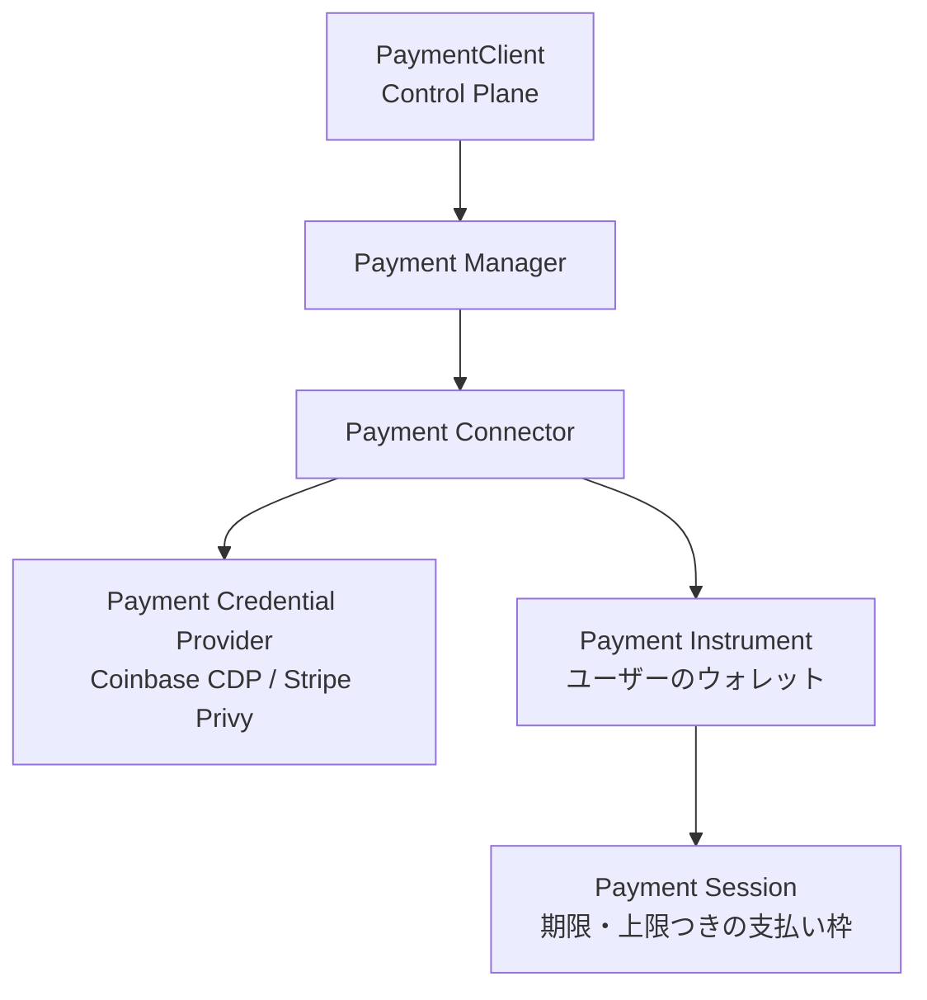
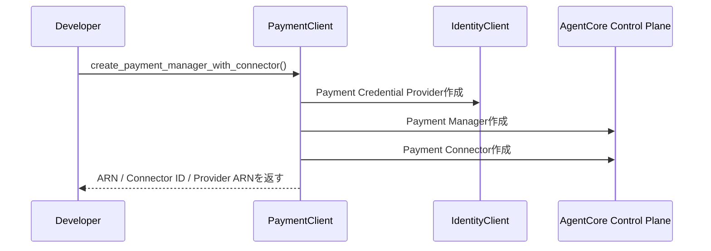
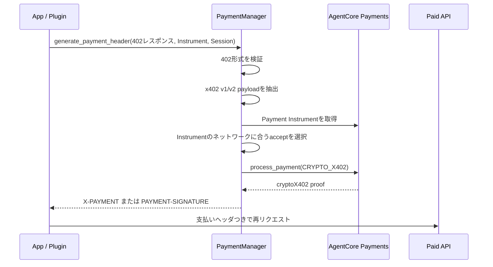
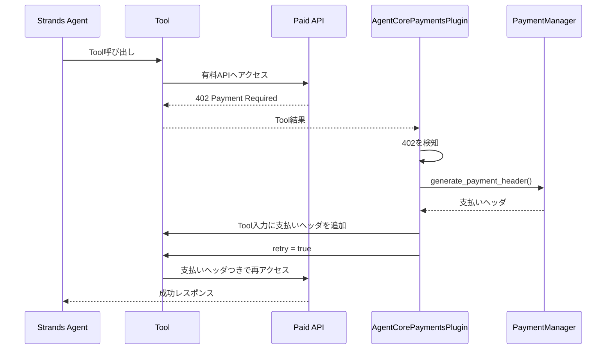
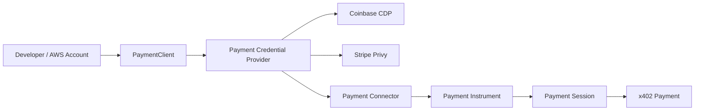

# Amazon Bedrock AgentCore Payments SDK 読み解きメモ

## 1. このファイルの位置づけ

このファイルは、Amazon Bedrock AgentCore Payments の公式ドキュメントではなく、Python SDK 側を読んだメモです。

対象は `bedrock-agentcore` SDK の Payments 関連です。確認したバージョンは `bedrock-agentcore 1.9.0` です。

公式ドキュメントは「AgentCore Payments で何を設定するか」を説明しています。一方でSDKを見ると、実装時にどのクラスが何を肩代わりするのかが分かります。

## 2. SDKで見るべき範囲

Payments 関連で主に見るべきファイルは次です。

| ファイル | 役割 |
| --- | --- |
| `bedrock_agentcore/payments/README.md` | SDK全体の説明、Quick Start、API概要 |
| `bedrock_agentcore/payments/client.py` | Control Plane。Payment Manager / Connector などの管理 |
| `bedrock_agentcore/payments/manager.py` | Data Plane。Instrument / Session / Payment 処理 |
| `bedrock_agentcore/payments/constants.py` | ステータス、Connector種別、ネットワーク優先順 |
| `bedrock_agentcore/payments/integrations/config.py` | Strands Plugin の設定値 |
| `bedrock_agentcore/payments/integrations/strands/plugin.py` | Strands Agent向けの自動支払い処理 |
| `bedrock_agentcore/payments/integrations/handlers.py` | Toolの402レスポンスを読み取るハンドラ |
| `bedrock_agentcore/payments/integrations/strands/README.md` | Strands Pluginの使い方 |

## 3. SDKの全体像

SDKのREADMEでは、Paymentsの構造は次のように整理されています。



ここで重要なのは、SDKが大きく2層に分かれていることです。

| 層 | 主なクラス | 役割 |
| --- | --- | --- |
| Control Plane | `PaymentClient` | Payment Manager、Connector、Credential Providerなどを作る |
| Data Plane | `PaymentManager` | Instrument、Session、支払い処理、x402ヘッダ生成を扱う |
| Agent連携 | `AgentCorePaymentsPlugin` | Strands AgentのTool呼び出しで402を検知し、自動で支払って再試行する |

## 4. `PaymentClient`: 支払い基盤を作るためのクラス

`PaymentClient` は、支払いの実行ではなく、支払い基盤を作るためのクラスです。

主に扱うリソースは次です。

| リソース | 説明 |
| --- | --- |
| Payment Manager | AgentCore Paymentsの支払い管理単位 |
| Payment Connector | Payment Managerと外部決済プロバイダをつなぐ |
| Payment Credential Provider | Coinbase CDPやStripe Privyの認証情報を保持する |

SDKには `create_payment_manager_with_connector()` という便利メソッドがあります。これは次をまとめて作ります。



`wait_for_ready=True` を指定すると、ManagerやConnectorが `READY` になるまでポーリングします。途中で失敗した場合は、作成済みリソースをロールバックする設計になっています。

対応しているCredential Providerはコード上では次の2種類です。

| Vendor | SDK上の値 | 必要な認証情報 |
| --- | --- | --- |
| Coinbase CDP | `CoinbaseCDP` | `api_key_id`, `api_key_secret`, `wallet_secret` |
| Stripe Privy | `StripePrivy` | `app_id`, `app_secret`, `authorization_private_key`, `authorization_id` |

注意点として、READMEの一部ではStripe Privyの例に `authorization_key` と書かれていましたが、`client.py` の型定義とバリデーションでは `authorization_private_key` と `authorization_id` が必須になっています。実装時は使っているSDKバージョンのコードを優先して確認する必要があります。

## 5. `PaymentManager`: 支払い実行側の中心クラス

`PaymentManager` はData Plane側の中心です。

主に次を扱います。

| メソッド | 役割 |
| --- | --- |
| `create_payment_instrument()` | ユーザーの支払い手段を作る |
| `get_payment_instrument()` | Instrument詳細を取得する |
| `get_payment_instrument_balance()` | Instrumentの残高を確認する |
| `list_payment_instruments()` | ユーザーのInstrument一覧を取得する |
| `delete_payment_instrument()` | Instrumentを削除する |
| `create_payment_session()` | 期限・上限つきの支払いセッションを作る |
| `get_payment_session()` | Session詳細、残り予算などを取得する |
| `list_payment_sessions()` | Session一覧を取得する |
| `delete_payment_session()` | Sessionを削除する |
| `process_payment()` | 実際に支払い処理を行う |
| `generate_payment_header()` | 402レスポンスからx402支払いヘッダを生成する |

特に重要なのは `generate_payment_header()` です。Strands Pluginも内部ではこのメソッドを呼びます。

## 6. `generate_payment_header()` がやっていること

`generate_payment_header()` は、HTTP 402 Payment Required レスポンスを受け取り、支払いを処理し、再リクエスト用の支払いヘッダを返すメソッドです。

流れは次です。



SDKコード上のポイントは次です。

1. `payment_required_request` は `statusCode`, `headers`, `body` を持つ必要がある。
2. `statusCode` は `402` でなければならない。
3. x402 v2は `Payment-Required` ヘッダからbase64 JSONを読む。
4. x402 v1はレスポンスbodyから読む。
5. `x402Version` と `accepts` が必須。
6. Instrumentのネットワークが `ETHEREUM` か `SOLANA` かを見て、対応する `accept` を選ぶ。
7. `process_payment()` に `payment_type="CRYPTO_X402"` を渡す。
8. 支払い結果の `paymentOutput.cryptoX402` からproofを取り出す。
9. x402 v1なら `X-PAYMENT`、x402 v2なら `PAYMENT-SIGNATURE` を返す。

つまり、アプリ側が直接ブロックチェーン署名やx402ヘッダ形式を組み立てる必要はありません。SDKが、AgentCore Paymentsに支払いを依頼して、API再呼び出しに必要なヘッダまで作ります。

## 7. ネットワーク選択の考え方

Instrument作成時のネットワークは大きく `ETHEREUM` と `SOLANA` です。

一方でx402の `accepts` には、より具体的なネットワーク名が入ります。たとえば次のようなものです。

| 系統 | 例 |
| --- | --- |
| Ethereum系 | `eip155:8453`, `eip155:1`, `base`, `eip155:42161`, `eip155:10`, `base-sepolia` |
| Solana系 | `solana-mainnet`, `solana-devnet`, `solana-testnet`, CAIP-2形式のgenesis hash |

SDKのデフォルト優先順では、Solana mainnetが先、次にBaseなどのEthereum系ネットワークが続きます。README上の説明では、低コスト・高速なネットワークを優先する意図です。

ただし、最終的には次の両方が一致する必要があります。

1. ユーザーのPayment Instrumentが対応しているネットワーク系統。
2. 支払い先APIのx402 `accepts` が提示しているネットワーク。

合うものがなければ、ヘッダ生成は失敗します。

## 8. `process_payment()` の位置づけ

`process_payment()` は支払いそのものをAgentCore Paymentsに依頼するメソッドです。

引数として主に次を渡します。

| 引数 | 意味 |
| --- | --- |
| `payment_session_id` | どの支払い枠で払うか |
| `payment_instrument_id` | どの支払い手段で払うか |
| `payment_type` | x402の場合は `CRYPTO_X402` |
| `payment_input` | x402 payload |
| `user_id` | ユーザー識別子。Bearer認証時はJWTの`sub`から導出可能 |
| `payment_connector_id` | 利用するConnectorを明示する場合に指定 |

エラーはSDK例外に変換されます。

| 例外 | 意味 |
| --- | --- |
| `InsufficientBudget` | Sessionの残り予算を超えた |
| `PaymentSessionExpired` | Sessionが期限切れ |
| `InvalidPaymentInstrument` | Instrumentが無効、またはinactive |
| `PaymentSessionNotFound` | Sessionが存在しない、または見つからない |
| `PaymentError` | その他の支払いエラー |

## 9. Strands Plugin: AIエージェント向けの自動支払い

`AgentCorePaymentsPlugin` は、Strands Agents向けのプラグインです。

アプリやエージェントがToolを呼び、そのToolが有料APIにアクセスしてHTTP 402を受け取った場合に、プラグインが支払い処理を自動化します。



ここでSDKが提供している価値は、エージェントアプリ側に「402を見て、x402を解釈し、支払いを処理し、再試行する」というコードを書かせないことです。

## 10. Strands Pluginの設定値

`AgentCorePaymentsPluginConfig` の主要な設定値は次です。

| 設定 | 意味 |
| --- | --- |
| `payment_manager_arn` | 必須。利用するPayment ManagerのARN |
| `user_id` | SigV4認証では必須。Bearer認証ではJWT `sub`から導出可能 |
| `payment_instrument_id` | 支払いに使うInstrument ID |
| `payment_session_id` | 支払いに使うSession ID |
| `payment_connector_id` | Connectorを明示する場合に指定 |
| `region` | AWSリージョン |
| `network_preferences_config` | 優先するブロックチェーンネットワーク |
| `auto_payment` | 402検知時に自動支払いするか。デフォルトは `True` |
| `payment_tool_allowlist` | 自動支払い対象のTool名を限定する |
| `max_interrupt_retries` | 支払い失敗時のinterrupt再試行上限。デフォルトは `5` |
| `agent_name` | Agent名。API呼び出しヘッダに伝播される |
| `bearer_token` | CUSTOM_JWT用の固定JWT |
| `token_provider` | CUSTOM_JWT用に都度JWTを返す関数 |

`bearer_token` と `token_provider` は同時に指定できません。

## 11. `auto_payment` と `payment_tool_allowlist`

`auto_payment=True` の場合、PluginはTool結果から402を探し、支払い処理を自動で試みます。

ただし、全Toolで勝手に支払いを許すのは危険です。そのため `payment_tool_allowlist` で対象Toolを限定できます。

例:

```python
AgentCorePaymentsPluginConfig(
    payment_manager_arn="arn:...",
    user_id="user-123",
    payment_instrument_id="payment-instrument-...",
    payment_session_id="payment-session-...",
    payment_tool_allowlist=["http_request", "mcp_proxy_tool_call"],
)
```

この設定にすると、指定されたToolだけが自動支払い対象になります。

実運用では、`auto_payment=True` を使う場合でも、少なくとも次を組み合わせるべきです。

1. Sessionの上限金額。
2. Sessionの有効期限。
3. Tool allowlist。
4. 監査ログ、CloudWatch metrics、X-Ray tracing。

## 12. Pluginが対応するToolレスポンス形式

Pluginは、Toolごとに402レスポンスの形が違うことを前提に、ハンドラを分けています。

| 条件 | ハンドラ | 内容 |
| --- | --- | --- |
| Tool名が `http_request` | `HttpRequestPaymentHandler` | `Status Code:`, `Headers:`, `Body:` 形式にも対応 |
| Tool入力に `toolName` と `parameters` がある | `MCPRequestPaymentHandler` | AgentCore Gateway / MCP Proxy系の形を検知 |
| その他 | `GenericPaymentHandler` | `PAYMENT_REQUIRED: {json}` 形式などを読む |

カスタムToolを自動支払い対応にするなら、SDK READMEでは `PAYMENT_REQUIRED: {json}` 形式で返す方法が示されています。

```python
return {
    "status": "error",
    "content": [{"text": f"PAYMENT_REQUIRED: {json.dumps(payment_required)}"}],
}
```

`payment_required` の中身は、少なくとも次の形に寄せる必要があります。

```python
{
    "statusCode": 402,
    "headers": response_headers,
    "body": response_body,
}
```

## 13. Pluginの失敗処理

Pluginは、支払いが失敗した場合に無限ループしないように制御しています。

主な制御は次です。

| 制御 | 内容 |
| --- | --- |
| `MAX_PAYMENT_RETRIES = 3` | 1つのTool呼び出しに対する支払い再試行上限 |
| post-payment failure検知 | 支払いヘッダを付けて再試行した後も402が返る場合、失敗として扱う |
| interrupt | 支払い設定不足や支払い失敗をアプリ側に通知する |
| `max_interrupt_retries` | interruptの再試行上限 |

Instrument IDがない場合は `PaymentInstrumentConfigurationRequired`、Session IDがない場合は `PaymentSessionConfigurationRequired` が使われます。

つまり、エージェントが勝手に無限支払いを続ける作りではありません。Session上限、再試行上限、interrupt、allowlistを組み合わせて制御する設計です。

## 14. SDKから分かる「AgentCore Paymentsでできること」

SDK目線で見ると、AgentCore Paymentsでできることは次です。

1. Coinbase CDPまたはStripe Privyの認証情報をAWS側リソースに接続する。
2. ユーザーごとのPayment Instrumentを作る。
3. Instrumentの残高を確認する。
4. 期限・上限つきのPayment Sessionを作る。
5. x402のHTTP 402レスポンスを解析する。
6. 支払い先APIが提示した `accepts` から、Instrumentに合う支払い条件を選ぶ。
7. `CRYPTO_X402` として支払い処理を依頼する。
8. 有料APIへ再リクエストするための支払いヘッダを生成する。
9. Strands Agentでは、402検知から再試行までをPluginに任せられる。

逆に、AgentCore Paymentsだけでは完結しないこともあります。

1. ユーザーがInstrumentへ資金を入れること。
2. ユーザーが署名権限を付与すること。
3. 有料API側がx402に対応していること。
4. アプリ側で予算・承認・利用規約・監査要件をどう設計するか。

## 15. Coinbase CDP / Stripe Privyとの関係

SDK上では、Coinbase CDPとStripe Privyは「支払い手段そのもの」というより、AgentCore Paymentsが接続する外部決済・ウォレット基盤として扱われています。



Coinbaseの場合、Instrument作成後に `redirectUrl` が返り、ユーザーはCoinbase-hosted WalletHubで資金追加や署名権限付与を行います。

Stripe Privyの場合、開発者が提供されたURLテンプレートやフロントエンドを使って、同様のユーザー操作画面を用意する説明になっています。

## 16. 実装時に詰まりやすい点

SDKを読む限り、実装時に詰まりやすいのは次です。

| ポイント | 注意 |
| --- | --- |
| Instrument作成だけでは支払えない | 資金追加と署名権限付与が別途必要 |
| Sessionが必要 | `payment_session_id` がないと自動支払いできない |
| Sessionには期限がある | READMEでは15〜480分の範囲と説明されている |
| x402対応APIが必要 | 支払い先がHTTP 402とx402 payloadを返す必要がある |
| ネットワーク不一致 | Instrumentのネットワーク系統とAPIの `accepts` が合わないと失敗 |
| Stripe Privyのcredential名 | README例とコードの必須項目が揺れているため、SDKバージョン確認が必要 |
| `PaymentManager`はthread-safeではない | 並行処理ではインスタンスを分ける |
| 自動支払いの範囲 | `payment_tool_allowlist` で対象Toolを絞るのが重要 |

## 17. 既存Markdownとの関係

このファイルは、既存のMarkdownの中では次の位置づけです。

| ファイル | 内容 |
| --- | --- |
| `01-general-programmatic-payments.md` | AWSやAIを抜いた、Programmatic Paymentsの一般論 |
| `02-ai-agent-programmatic-payments.md` | AIエージェントが絡むと何が変わるか |
| `03-aws-agentcore-payments.md` | AgentCore Paymentsの概要 |
| `04-aws-agentcore-payments-implementation-flow.md` | AWS公式ドキュメントベースの実装手順 |
| `05-aws-agentcore-payments-observability.md` | 監視・メトリクス・トレース |
| `06-agentcore-payments-sdk-notes.md` | SDK READMEとコードから見た実装構造 |

## 18. まとめ

SDKを読むと、AgentCore Paymentsは単に「支払い管理リソース」ではなく、x402の402レスポンスを支払い実行に変換し、API再呼び出し用の支払いヘッダを作るところまで持っています。

ただし、実際のお金の移動やウォレット操作は、Coinbase CDPやStripe Privyなどの外部プロバイダ、およびユーザーの資金追加・署名許可に依存します。

初心者向けに一言で言うなら、AgentCore Payments SDKは次の3つを分担しています。

1. `PaymentClient`: 支払い基盤を作る。
2. `PaymentManager`: 支払い手段・支払い枠・x402支払い処理を扱う。
3. `AgentCorePaymentsPlugin`: AIエージェントのTool呼び出しで402が返ったときに、自動で支払って再試行する。
