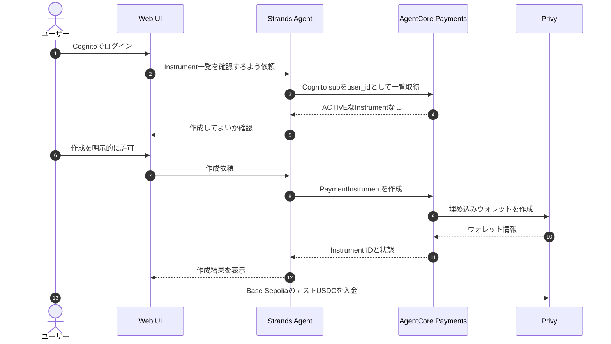
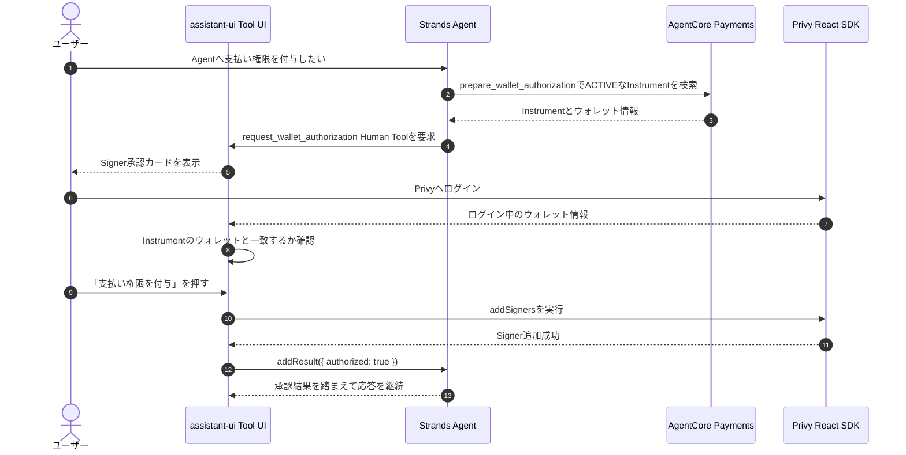
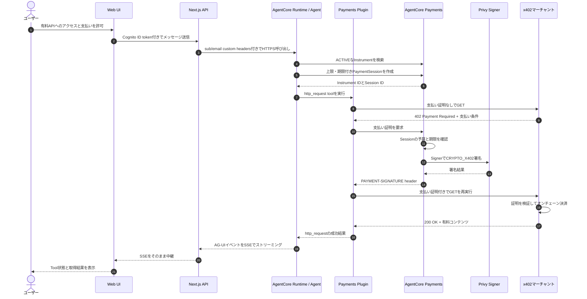

# AgentCore Paymentsの現在の実装とE2E検証結果

## この資料の目的

このプロジェクトに実装済みのAgentCore Payments構成と、2026年6月に実施した
Base SepoliaでのE2E支払い検証結果を記録する。

一般的なPaymentsの説明ではなく、現在のコードで何が動いているかを確認するための資料である。

## 現在の全体構成

```text
ブラウザ
  | Cognito ID token + Cognito sub/email
  v
Next.js Route Handler (/api/agent)
  | HTTPS + SSE
  | AgentCore Runtime custom headers
  v
AgentCore Runtime
  | AG-UI Strands
  | AgentCore Payments Plugin
  v
x402対応の有料HTTP API
```

主な実装ファイル:

- `src/app/api/agent/route.ts`
- `src/app/components/agent-assistant.tsx`
- `agent-runtime/app.py`
- `agent-runtime/request_context.py`
- `agent-runtime/tools/payments.py`
- `agent-runtime/prompts/system_prompt.md`
- `amplify/agent-core-stack.ts`

## まず登場人物を整理する

| 登場人物 | 役割 |
|---|---|
| ユーザー | ログイン、ウォレット作成、入金、Signer承認、支払い許可を行う |
| Web UI | Cognito認証とPrivy Signer承認画面を提供する |
| Next.js API | ブラウザとAgentCore Runtimeの間で認証情報とSSEを中継する |
| Agent | ユーザーと対話し、必要なtoolを選んで実行する |
| Payments Plugin | `http_request`の402を検出し、支払いと再試行を自動化する |
| AgentCore Payments | Instrument、Session、予算、支払い証明を管理する |
| Privy | ユーザーの埋め込みウォレットとSignerを管理する |
| マーチャント | x402対応の有料APIまたは有料コンテンツを提供する |

## 全体を3段階で理解する

```text
段階1: 支払い手段を準備する
  Instrument作成 -> ウォレット入金

段階2: Agentへ支払い権限を付ける
  Privyログイン -> Signer承認

段階3: 有料コンテンツを購入する
  402受信 -> ProcessPayment -> 支払い証明付き再試行 -> 200
```

Instrument、Signer、Sessionは同じものではない。

- Instrumentは「どのウォレットを使うか」
- Signerは「Agentがそのウォレットを使って署名してよいか」
- Sessionは「今回いくらまで、いつまで使ってよいか」

## シーケンス1: PaymentInstrumentを準備する



この段階ではウォレットは存在するが、Agentが署名できるとは限らない。

## シーケンス2: Privy Signerを承認する



Signer承認はAgent側ではなくブラウザ側で実行する。ユーザーがボタンを押す前に、
Agentが勝手にSignerを追加することはない。

## 認証とユーザー識別

WebアプリはAmplify AuthからCognito ID tokenを取得し、Next.jsの`/api/agent`へ送る。
Next.jsはBearer tokenをAgentCore RuntimeのHTTPS data planeへ渡す。

同時に、次のAgentCore Runtime custom headersを使用してユーザー情報を渡す。

```text
X-Amzn-Bedrock-AgentCore-Runtime-Custom-User-Sub
X-Amzn-Bedrock-AgentCore-Runtime-Custom-User-Email
```

- Cognito `sub`はAgentCore Paymentsの`user_id`として使用する
- emailはPaymentInstrument作成時のPrivy linked accountにだけ使用する
- emailは画面やエージェントの回答に表示しない

Runtimeでは`ContextVar`にリクエスト単位のユーザー情報を保持し、Payments toolsから参照する。

## PaymentInstrument

PaymentInstrumentはユーザーの支払い手段をAgentCore Payments上で表すリソースである。
現在はStripe/Privy connectorによる埋め込み型暗号ウォレットを使用している。

Agentへ公開している操作:

- Plugin提供: 一覧取得、詳細取得、残高確認
- 自作tool: 作成、削除、Privy Signer承認に必要なウォレット情報の取得
- assistant-ui Human Tool: Privy Signer承認UIの表示と承認結果の返却
- 内部処理: ACTIVEなInstrumentの検索

一覧取得、詳細取得、残高確認、Session確認、`http_request`は
`AgentCorePaymentsPlugin`が提供するtoolを利用する。同名の自作toolは持たない。

DBへPaymentInstrument IDを保存せず、Cognito `sub`を`user_id`として一覧を取得し、
ACTIVEなInstrumentを実行時に検索する。

削除はPayments API上の削除処理であり、通常の一覧から除外される。監査用の記録まで
物理的に消去されることを意味しない。

## PaymentSession

AgentCore RuntimeはPayments Pluginを作る際、リクエストごとにPaymentSessionを作成する。

現在の既定値:

```text
maxSpendAmount: USD 10.00
expiryTimeInMinutes: 60
```

PaymentSessionは実際のウォレット残高ではなく、そのセッションで許可する支出上限と
有効期間を表す。ウォレットに資金がない場合、上限内でも支払いは成功しない。

Session作成はAgent toolとして公開しない。リクエスト開始時に作成したSession IDを
Payments Pluginへ設定し、AgentからはPlugin提供の`get_payment_session`で状態だけ確認する。

現在の`USD 10.00`は検証用として大きいため、本番導入時は利用ケースに合わせて
大幅に小さくする必要がある。

## Privy Signer承認

PaymentInstrumentを作成しただけでは、Agentはウォレットを使って支払い証明を生成できない。
ユーザーによるSigner権限の付与が必要になる。

現在の流れ:

1. Agentが`prepare_wallet_authorization` toolを実行する
2. toolがACTIVEなInstrumentのPaymentInstrument ID、ウォレットアドレス、ネットワークを返す
3. Agentが同じ値を`request_wallet_authorization` Human Toolへ渡す
4. assistant-uiのTool UIがSigner承認カードを表示する
5. ユーザーがPrivyへログインする
6. Web UIが対象ウォレットとログイン中のPrivyウォレットを照合する
7. ユーザーが「支払い権限を付与」を押す
8. Privy React SDKの`addSigners`を実行する
9. UIが`addResult({ authorized: true })`で承認結果をAgentへ返す
10. Agentが承認結果を踏まえて次の応答を継続する

現在の実装は次の指定でSignerを追加している。

```ts
signers: [{ signerId: PRIVY_SIGNER_ID, policyIds: [] }]
```

`policyIds: []`は検証用であり、送金先、金額、ネットワークなどの制限をPrivy Policyで
設定していない。本番では必ず制限付きPolicyへ変更する。

## Strands AgentCore Payments Plugin

RuntimeはACTIVEなInstrumentと新しいPaymentSessionを取得し、
`AgentCorePaymentsPluginConfig`へ設定する。

現在の主な設定:

```text
payment_manager_arn
user_id
payment_instrument_id
payment_session_id
payment_connector_id
region = us-east-1
payment_tool_allowlist = ["http_request"]
agent_name = strands_agent
```

自動支払い対象は`http_request` toolだけである。他のPayments管理toolを実行しただけで
支払い処理は開始されない。

## pluginとAG-UI hook

Strandsの`Agent`にはPayments Plugin自体を渡している。

```python
Agent(..., plugins=[payments_plugin])
```

AG-UIの`StrandsAgent`ラッパーには、Pluginが公開するhookを明示的に渡している。

```python
hooks = list(payments_plugin.hooks)
StrandsAgent(..., hooks=hooks)
```

このhookにより、Payments Pluginの`BeforeToolCallEvent`と`AfterToolCallEvent`が
AG-UI経由のtool実行でも発火する。`AfterToolCallEvent`が`http_request`の402結果を検出し、
支払い処理とtool再試行を開始する。

詳細は`09-agui-strands-hooks-payments-plugin.md`を参照する。

## AG-UIストリーミング

AgentCore RuntimeはFastAPIの`StreamingResponse`でAG-UIイベントを返す。
Next.js Route Handlerはレスポンスbodyを読み切らず、そのReadableStreamをブラウザへ中継する。

AG-UI側のメッセージイベントと`MESSAGES_SNAPSHOT`の両方をassistant-uiが処理すると
同じメッセージやTool UIが二重表示された。このため現在は次の設定を使用している。

```python
StrandsAgentConfig(emit_messages_snapshot=False)
```

assistant-uiはストリーミングされた`TEXT_MESSAGE_*`と`TOOL_CALL_*`イベントから画面を構築する。

## x402支払い時の実行シーケンス

検証で確認した実際の流れを図にすると次のようになる。



上の図を処理単位で書き直すと次のとおり。

1. Agentが`http_request`で有料APIへGETする
2. 有料APIが`402 Payment Required`とx402 payment requirementsを返す
3. Payments Pluginの`AfterToolCallEvent`が402を検出する
4. PluginがPaymentManagerへ支払い証明の生成を依頼する
5. PaymentManagerがPaymentInstrumentとPaymentSessionを検証する
6. Privy Signerを使って`CRYPTO_X402`支払いを処理する
7. Pluginが`PAYMENT-SIGNATURE` headerをtool inputへ追加する
8. Pluginが同じ`http_request`を再実行する
9. 有料APIが支払いを検証・決済する
10. 有料APIが`200 OK`とコンテンツを返す

`ProcessPayment`をアプリケーションコードから直接呼び出してはいないが、Payments Pluginが
402を処理する過程でAgentCore Paymentsの支払い処理を実行している。

## E2E検証結果

検証条件:

- Wallet provider: Stripe/Privy
- Network: Base Sepolia (`eip155:84532`)
- Asset: テストUSDC
- Price: `$0.001`
- Paid endpoint: CloudFront上の検証用天気API
- Agent tool: `http_request`

CloudWatchで次の事実を確認した。

1. 最初のGETは`402 Payment Required`
2. Pluginが402を検出
3. `CRYPTO_X402`の支払い処理が成功
4. `PAYMENT-SIGNATURE` headerを生成
5. 同じGETを再実行
6. 再実行は`200 OK`
7. APIレスポンスの`settled`は`true`

したがって、次の経路はE2Eで動作確認済みである。

```text
Cognito認証
  -> Next.js SSE中継
  -> AgentCore Runtime
  -> Strands http_request
  -> Payments Plugin
  -> Privy Signer
  -> x402決済
  -> 有料コンテンツ取得
```

## 表示上で見つかった問題

エージェントの自然言語回答に含まれたトランザクションIDは、実際のtool resultにある値を
1文字誤って出力していた。CloudWatch内の`payment-response`に含まれる値は正常だった。

支払いの成功判定や監査では、LLMが再生成した本文を根拠にしてはいけない。今後は
構造化されたtool resultまたはpayment responseをTool UIで直接表示する必要がある。

## 本番化前の必須対応

1. PaymentSessionの既定上限を用途に合わせて小さくする
2. 支払い前に金額、通貨、ネットワーク、受取先、対象URLをUIへ表示する
3. ユーザーの明示的な支払い承認を構造化されたHITLとして実装する
4. Privy Signerへ制限付きPolicyを設定する
5. `http_request`でアクセスできるURLまたはドメインをallowlist化する
6. LLM本文ではなく構造化された決済結果を画面表示・監査保存する
7. CloudWatch Metrics、Logs、X-Ray、支出アラートを設定する
8. PaymentSession、支払い、失敗、再試行をユーザー単位で追跡する
9. PreviewサービスのAPI変更と障害時の扱いを運用手順に含める
10. Base Mainnetへ移行する前にAWS WAFの`TEST`モードで再検証する

## 次の検証

次は外部マーチャントを探すのではなく、AWS Blocksで販売サイトを作り、CloudFrontへ
AWS WAF AIトラフィック収益化を手動設定する。

これにより、自作の`withX402` routeではなく、AWS WAFが生成する402と決済フローを
現在のAgentCore Payments実装で処理できるか確認する。

販売サイト側の計画は`10-waf-ai-monetization-merchant-site.md`を参照する。

## 参考資料

- [AgentCore Payments](https://docs.aws.amazon.com/bedrock-agentcore/latest/devguide/payments.html)
- [How AgentCore Payments works](https://docs.aws.amazon.com/bedrock-agentcore/latest/devguide/payments-how-it-works.html)
- [Process a payment](https://docs.aws.amazon.com/bedrock-agentcore/latest/devguide/payments-process-payment.html)
- [AWS WAF AIトラフィック収益化](https://aws.amazon.com/jp/blogs/news/aws-waf-adds-ai-traffic-monetization-capability-to-help-content-owners-charge-ai-bots-for-content-access/)
